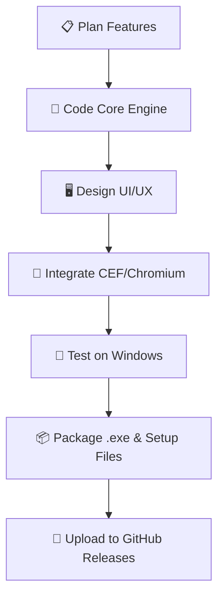

<h1 align="center">🌐 Vyrnix Browser</h1>
<p align="center">
  
</p>

<p align="center">
🚀 Fast. 🔒 Private. 🎨 Beautiful.<br>
An open-source, secure, and lightning-fast web browser.
</p>

<p align="center">
  <a href="https://github.com/ZainulabdeenOfficial/Vyrnix-Browser/releases"></a>
  <a href="mailto:zu4425@gmail.com"></a>
  <a href="LICENSE"></a>
</p>

---

## 📥 Download Now

📁 All files are hosted in the **[Releases section »](https://github.com/ZainulabdeenOfficial/Vyrnix-Browser/releases)**:

- 💻 `Vyrnix-Source-Code.zip` – Full source code  
- 🛠️ `Vyrnix.exe` – Precompiled executable  
- 📦 `Vyrnix-Setup.exe` – Complete installation setup  

> ❗ **Note:** GitHub doesn't allow uploading very large files directly to the repository, so everything is available via Releases.

---

## ✨ Key Features

- ⚡ Super-fast browsing experience
- 🔒 Enhanced privacy and security
- 🧊 Clean & modern UI (Chromium-powered)
- 🌙 Built-in Dark Mode
- 🧩 Support for extensions and tabs
- 🧠 Smart session restore
- 🎨 Customizable themes
- 🚫 Ad-blocker and tracker blocker

---

## 🛠️ Build & Development Workflow



### 🧰 Tech Stack

- 🖥️ **Language:** C++, HTML, JS  
- ⚙️ **Framework:** Chromium Embedded Framework (CEF)  
- 🛠️ **Tools:** CMake, Visual Studio  
- 🪟 **Platform:** Windows Desktop (x64)

---

## 👨‍💻 Getting Started Locally

```bash
git clone https://github.com/ZainulabdeenOfficial/Vyrnix-Browser.git
```

> ⚠️ If you don't see the source code here, download it from the [Releases section](https://github.com/ZainulabdeenOfficial/Vyrnix-Browser/releases).

Then:

1. Open project in Visual Studio  
2. Configure build as `Release x64`  
3. Click `Build > Build Solution`  
4. Run the `.exe` file from output folder

---

## 🚧 Upcoming Features

- 🧩 Extension marketplace  
- 🛡️ Built-in VPN/proxy tools  
- ☁️ Cross-device sync for bookmarks/history  
- 🧪 Linux/macOS support  
- 🧼 Minimal/Zen UI Mode  

---

## 💬 Feedback & Support

Got ideas or need help?

📩 Email me at: **[zu4425@gmail.com](mailto:zu4425@gmail.com)**  
🐛 Found a bug? [Open an issue »](https://github.com/ZainulabdeenOfficial/Vyrnix-Browser/issues)

---

## 📄 License

This project is released under the [Eclipse Public License 2.0 ](LICENSE).

---

<p align="center">Made with ❤️ by <a href="https://github.com/ZainulabdeenOfficial">Zain Ul Abdeen</a></p>


---
